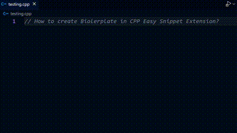

# Lazy Coder

## Description

Boost your C++ development productivity with the CPP Boilerplate Generator extension for Visual Studio Code. Say goodbye to repetitive code setup and hello to streamlined project initialization. This extension provides essential C++ boilerplate code snippets and templates, helping you kickstart your projects swiftly and efficiently.

## How to use

**Step 1:** Install CPP Easy Snippet<br>
**Step 2:** Not Download Yet? [Download Now](https://marketplace.visualstudio.com/items?itemName=MahfujulSagor.lazycoder)<br>
**Step 3:** Find all snippets below and use as per need.<br>
**Step 4:** Happy Coding<br>

## Watch Tutorial



## All C++ Snippets

| No  | CPP Snippet Short Code | Header Files Include        |
| :-- | :--------------------- | :-------------------------- |
| 1   | io                     | iostream                    |
| 2   | cpphello               | iostream, helloworld        |
| 3   | ioal                   | iostream, algorithm         |
| 4   | iovec                  | iostream, vector            |
| 5   | iostr                  | iostream, string            |
| 6   | ioset                  | iostream, set               |
| 7   | iomap                  | iostream, map               |
| 8   | iopair                 | iostream, utility           |
| 9   | iostack                | iostream, stack             |
| 10  | ioque                  | iostream, queue             |
| 11  | iodeque                | iostream, deque             |
| 12  | iopq                   | iostream, queue             |
| 13  | iolist                 | iostream, list              |
| 14  | ioit                   | iostream, iterator          |
| 15  | ioalvec                | iostream, algorithm, vector |
| 16  | iostackvec             | iostream, stack, vector     |

---

### View Snippet Codes

**1. io = iostream**

```cpp
#include <iostream>
using namespace std;
int main()
{
    return 0;
}
```

**2. cpphello = iostream + hello**

```cpp
#include <iostream>
using namespace std;
int main()
{
    cout << "Hello World!" << endl;
    return 0;
}
```

**3. ioal = iostream + algorithm**

```cpp
#include <iostream>
#include <algorithm>
using namespace std;

int main()
{
    return 0;
}
```

**4. iovec = iostream + vector**

```cpp
#include <iostream>
#include <vector>
using namespace std;
int main()
{
    return 0;
}
```

**5. iostr = iostream + string**

```cpp
#include <iostream>
#include <string>
using namespace std;
int main()
{
    return 0;
}
```

**6. ioset = iostream + set**

```cpp
#include <iostream>
#include <set>
using namespace std;
int main()
{
    return 0;
}
```

**7. iomap = iostream + map**

```cpp
#include<iostream>
#include <map>
using namespace std;
int main()
{
    return 0;
}
```

**8. iopair = iostream + utility**

```cpp
#include<iostream>
#include <utility>
using namespace std;
int main()
{
    return 0;
}
```

**9. iostack = iostream + stack**

```cpp
#include <iostream>
#include <stack>
using namespace std;
int main()
{
    return 0;
}
```

**10. ioque = iostream + queue**

```cpp
#include<iostream>
#include <queue>
using namespace std;
int main()
{
    return 0;
}
```

**11. iodeque = iostream + deque**

```cpp
#include<iostream>
#include <deque>
using namespace std;
int main()
{
    return 0;
}
```

**12. iopq = iostream + queue**

```cpp
#include<iostream>
#include <queue>
using namespace std;
int main()
{
    return 0;
}
```

**13. iolist = iostream + list**

```cpp
#include<iostream>
#include <list>
using namespace std;
int main()
{
    return 0;
}
```

**14. ioit = iostream + iterator**

```cpp
#include<iostream>
#include <iterator>
using namespace std;
int main()
{
    return 0;
}
```

**15. ioalvec = iostream + algorithm + vector**

```cpp
#include<iostream>
#include <algorithm>
#include <vector>
using namespace std;
int main()
{
    return 0;
}
```

**16. iostackvec = iostream + stack + vector**

```cpp
#include <iostream>
#include <stack>
#include <vector>
using namespace std;
int main()
{
    return 0;
}
```

**Enjoy!**
